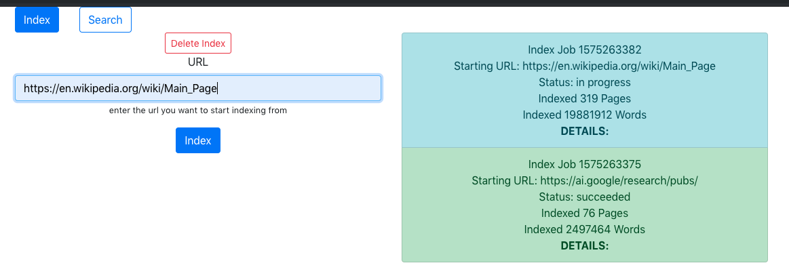
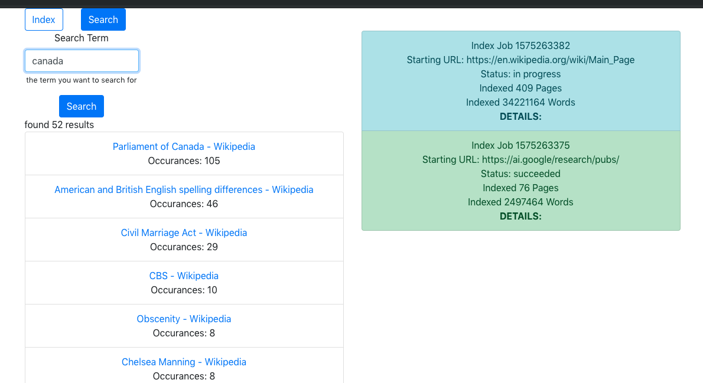

# simple-indexer

## What is it?
A web-based application that will allow one to index words on a web page for a given URL,
and follow links for up to 3 steps deep

## Quick Start
make sure you have [Docker](https://www.docker.com/) installed.

```
docker-compose up --build
```

This will run the front-end on port 3000 and the backend on port 8080.  You can view the program at http://localhost:3000

**NOTE** it is suggested that you run the backend with at least 2GB of ram

## Constraints

_Do not replicate_ - this program stores its index in memory, so you can not run this in a replicated environment

_Hard-coded ports_ - port numbers are not configurable (via env variables, CLI args, etc.)

_No CORS_ - CORS is disabled for the backend for local use, this program should never be used in production like this (I am not sure why you would though)

_The frontend runs in dev mode_ - for simplicity, the frontend is a [react](https://reactjs.org/) application running in development mode, even in
the Docker container

## Known bugs

_Memory leak_ - there is a memory leak where if you delete an index, the old index still takes up memory, though it is no longer referenced, this
can be seen by running the Docker image, indexing something, deleting the index, all while watching `docker stats`

## How does the index work?

Upon receiving a web page's contents, the crawler will split the content by whitespace (" ", "\t", "\n").  This will form "words".  Each word is
lower-cased, then an index is created which serves as a mapping from word-->web pages

Upon lookup, the indexer will take the search term, find all keys in the index that contain that search term (ex. if "Clayton", "Clay", and "Clayt" were indexed, then a search for "Clay"
would should results for all 3).

## Indexing a URL

You can click "Index", then enter a URL, then the other "Index" button below the url to index




## Searching

